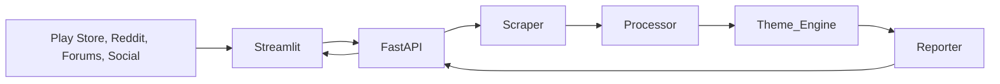

# Spotify Review Discovery Engine 🎵

An AI-powered pipeline to analyze Spotify reviews from the Google Play Store, generating actionable product insights and "Weekly Discovery Notes" using Groq's LLM.

## 🚀 Overview

This tool automates the process of understanding user feedback. It scrapes live reviews, filters for high-quality English content, redacts PII, and uses **Llama-3.3** to categorize feedback into core product discovery themes.

### User Flow


### Key Features
- **Decoupled Architecture**: FastAPI Backend + Streamlit Frontend.
- **AI Analysis**: Powered by Groq (Llama-3.3-70b & Llama-3.1-8b).
- **Strict Filtering**: Only keeps English reviews (90%+ confidence) and removes PII.
- **Weekly Reports**: Generates a markdown "Weekly Note" with top themes, user quotes, and action ideas.

## 🏗️ Architecture

1.  **Phase 1: Data Acquisition**: Scrapes latest reviews from Play Store, Reddit, and Forums.
2.  **Phase 2: Data Preprocessing**: Cleans PII and filters for strict English.
3.  **Phase 3: Theme Generation**: AI identifies top 6 product themes and categorizes reviews.
4.  **Phase 4: Synthesis**: Generates the Weekly Discovery Note.
5.  **Phase 7 & 8**: Decoupled REST API (FastAPI) and Interactive Dashboard (Streamlit).

## 🛠️ Setup & Installation

### 1. Prerequisites
- Python 3.10+
- [Groq API Key](https://console.groq.com/)

### 2. Install Dependencies
```bash
pip install -r requirements.txt
```
*(Dependencies: `streamlit`, `fastapi`, `uvicorn`, `requests`, `groq`, `python-dotenv`, `google-play-scraper`, `langdetect`)*

### 3. Environment Variables
Create a `.env` file in the root directory:
```env
GROQ_API_KEY=your_groq_api_key_here

# Optional: Email Configuration
SENDER_EMAIL=your_email@gmail.com
RECEIVER_EMAIL=recipient_email@gmail.com
SMTP_PASSWORD=your_app_password
```

## 🏃 How to Run
```

## ☁️ Streamlit Cloud Deployment

This project is optimized for [Streamlit Cloud](https://streamlit.io/cloud).

### 1. Push to GitHub
Ensure all changes (including `requirements.txt`) are pushed to your repository.

### 2. Connect to Streamlit Cloud
- Go to [share.streamlit.io](https://share.streamlit.io).
- Select your repository and the `main` branch.
- Set the Main file path to `app.py`.

### 3. Configure Secrets
In the Streamlit Cloud dashboard, go to **Settings > Secrets** and add your Groq API Key:
```toml
GROQ_API_KEY = "your_actual_key_here"
```

The app will automatically detect that it's running on the cloud and use **Direct Execution Mode** (bypassing the need for a separate FastAPI process).
To run the full system, you need to start both the **Backend** and the **Frontend**.

### 1. Start the FastAPI Backend
```bash
python backend/main.py
```
*API will be available at http://localhost:8000. View docs at /docs.*

### 2. Start the Streamlit Frontend
In a new terminal:
```bash
streamlit run app.py
```
*Dashboard will be available at http://localhost:8501.*

## 📈 Dashboard Features
- **Navigation Nudges**: Switch between the "Latest Weekly Note" and a "Deep Dive by Themes".
- **Trigger Analysis**: A single button in the sidebar triggers the entire background pipeline via the API.

---
*Built with ❤️ for Spotify Product Discovery.*
