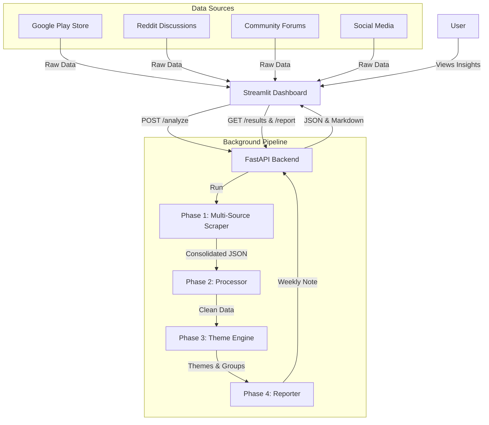

# Spotify Review Discovery Engine - Detailed Architecture

## 1. Overview
The Spotify Review Discovery Engine is an automated pipeline designed to scrap, process, and analyze Google Play Store reviews using the Groq LLM. The goal is to extract actionable product insights regarding music discovery and user frustrations.

## 2. User Flow Diagram


## 3. Phase-Wise Architecture

### Phase 1: Data Acquisition (Multi-Source Scraper)
- **Component**: `scraper.py`
- **Sources**: 
    - **Google Play Store**: App reviews via `google-play-scraper`.
    - **Reddit**: Subreddit discussions (e.g., r/spotify) via PRAW.
    - **Community Forums**: Spotify Community threads.
    - **Social Media**: Filtered conversations/mentions.
- **Input**: App IDs, Subreddits, Keywords.
- **Process**: 
    - Fetch and consolidate data into a unified format.
    - Filter by date (last 8-12 weeks).
    - Limit: 500 records per source.
- **Output**: `data/raw_reviews.json` (Unified Schema)

### Phase 2: Data Preprocessing
- **Component**: `processor.py`
- **Process**:
    - Strict Language Filtering: Keep only English reviews with 90%+ confidence and ASCII-heavy character counts.
    - PII Redaction: Remove names, emails, phone numbers using regex.
    - Length Filter: Remove reviews with less than 5 words.
- **Output**: `data/cleaned_reviews.json`

### Phase 3: AI Analysis Engine (Groq)
- **Component**: `theme_engine.py`
- **LLM**: Groq (Llama-3.3-70b / Llama-3.1-8b).
- **Process**:
    - **Step 3.1: Theme Generation**: Analyze a subset of reviews to identify the top 6 themes.
    - **Step 3.2: Review Classification**: Map each review to one or more of the 6 themes.
- **Goal Questions Answered**:
    1. Why do users struggle to discover new music?
    2. What are the most common frustrations with recommendations?
    3. What listening behaviors are users trying to achieve?
    4. What causes users to repeatedly listen to the same content?
    5. Which user segments experience different discovery challenges?
    6. What unmet needs emerge consistently across reviews?

### Phase 4: Synthesis & Reporting
- **Component**: `reporter.py`
- **Process**:
    - Select the Top 3 most prevalent themes.
    - Extract 3 high-impact user quotes per theme.
    - Generate 3 "Action Ideas" based on LLM inference.
- **Output**: `reports/weekly_note.md`

### Phase 7: Backend API (FastAPI) [NEW]
- **Component**: `backend/main.py`
- **Role**: Provides a RESTful interface for the discovery engine.
- **Endpoints**:
    - `POST /analyze`: Triggers the pipeline via background workers.
    - `GET /results`: Returns the latest themed reviews.
    - `GET /report`: Fetches the "Weekly Note" content.

### Phase 8: UI Frontend (Streamlit) [NEW]
- **Component**: `app.py`
- **Role**: A decoupled frontend that consumes the FastAPI backend over HTTP.
- **Visuals**: Metrics, themes exploration, and report preview.

## 3. Data Schema (Internal)
```json
{
  "review_id": "string",
  "date": "ISO8601",
  "rating": "int",
  "title": "string",
  "text": "string",
  "theme": "string",
  "is_pii_clean": "boolean"
}
```

## 4. Tech Stack
- **Language**: Python 3.10+
- **LLM API**: Groq (Speed & Cost efficiency)
- **Libraries**:
    - `google-play-scraper`: For Google Play Store data.
    - `pandas`: For data manipulation.
    - `groq`: For LLM integration.
    - `streamlit`: For the UI dashboard (Frontend).
    - `fastapi`: For the backend REST API.
    - `uvicorn`: For the ASGI server.
    - `python-dotenv`: Management of API keys.
    - `requests`: For frontend-backend communication.
